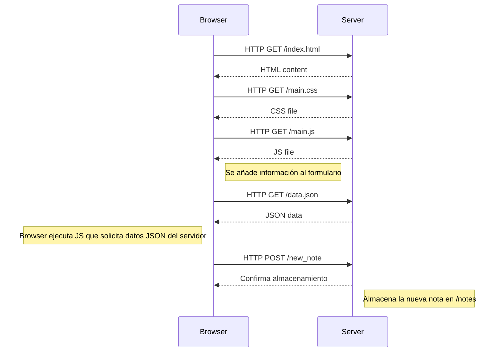

```mermaid
sequenceDiagram
    participant Browser
    participant Server

    Browser->>Server: HTTP GET /index.html
    Server-->>Browser: HTML content

    Browser->>Server: HTTP GET /main.css
    Server-->>Browser: CSS file

    Browser->>Server: HTTP GET /main.js
    Server-->>Browser: JS file

    Note right of Browser: Se añade información al formulario

    Browser->>Server: HTTP GET /data.json
    Server-->>Browser: JSON data

    Note left of Browser: Browser ejecuta JS que solicita datos JSON del servidor

    Browser->>Server: HTTP POST /new_note
    Server-->>Browser: Confirma almacenamiento

    Note right of Server: Almacena la nueva nota en /notes
```
